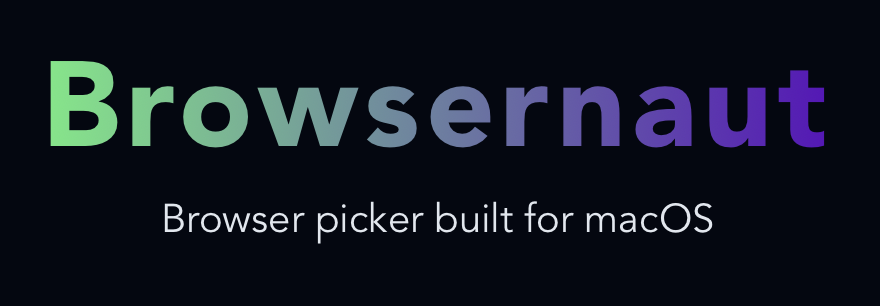
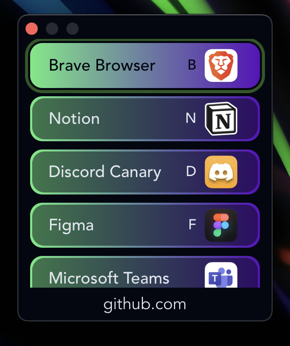

# Browsernaut

  

An application picker to help simplify link opening

Strongly inspired by [Browserosaurus](https://github.com/will-stone/browserosaurus), but built using Tauri instead of Electron in order to drastically decrease the size.

## About

Browsernaut is a macOS application designed to open URLs in various applications beyond web browsers such as Notion, Figma, Discord, and more. It provides a seamless experience by redirecting URLs to their corresponding applications, enhancing productivity and workflow efficiency.

When you click on a link in an application that isn't your default web browser you'll be met with the App Picker:

  

## Features

- [x] Full support for dark and light themes
- [x] Re-ordering applications for app picker
- [x] Add hotkeys for favorite apps
- [x] Modifier support
- [x] Built in automatic updates
- [ ] Customizable themes - *In Progress*
  Todo List:
  - [ ] Add ability to add new custom theme
  - [ ] Allow for adding multiple themes
  - [ ] Add ability to import themes
- [ ] Automatic TLD handling per app

## Tech Stack

Browsernaut is built using the following technologies:

- [Tauri](https://tauri.studio): Tauri is a framework for building native desktop applications using web technologies. It combines the flexibility of web development with the power and capabilities of native applications.
- [React](https://reactjs.org): React is a popular JavaScript library for building user interfaces. It provides a declarative and component-based approach to UI development.
- [Vite](https://vitejs.dev): Vite is a fast and lightweight build tool for modern web applications. It offers near-instantaneous hot module replacement (HMR) and optimized production builds.
- [TypeScript](https://www.typescriptlang.org): TypeScript is a statically-typed superset of JavaScript that adds type annotations and advanced language features to enhance code quality and maintainability.
- [Zustand](https://github.com/pmndrs/zustand): Zustand is a minimalistic state management library for React. It allows you to manage application state with ease and simplicity.
- [shadcn/ui](https://github.com/shadcn/ui): shadcn/ui makes it incredibly easy to build and theme most aspects of an applicaiton

## Why Tauri?

While Electron is a popular choice for building desktop applications using web technologies, Browsernaut leverages Tauri a few key reasons:

1. **Performance**: Tauri provides a smaller bundle size and faster startup times compared to Electron, resulting in a more responsive and lightweight application.
2. **Resource Efficiency**: Tauri consumes fewer system resources, making it ideal for running Browsernaut alongside other applications without significant impact on overall system performance.
3. **Native Look and Feel**: Tauri allows you to create truly native applications that blend seamlessly with the user's operating system, providing a familiar and intuitive user experience.
4. **Security**: Tauri takes security seriously and provides built-in features like sandboxing and communication whitelisting, reducing potential attack vectors and enhancing overall application security.
5. **Simple Updates**: Tauri makes it super simple to keep your application up to date by including it's own updater and API for interacting with it.

## Installation

Head over to our release to download the latest version of Browsernaut. Once installed the app will check for updates on restart and automatically download and install the most up to date version.

Browsernaut can also be installed via homebrew. With homebrew installed you can install by adding the tap and installing the cask:

`brew tap billyjacoby/browsernaut && brew install browsernaut`

## Getting Started

To get started with Browsernaut development, follow these steps:

1. Clone the repository: `git clone https://github.com/billyjacoby/Browsernaut.git`
2. Install dependencies: `cd Browsernaut && yarn install`
3. Build the application in debug mode: `yarn build:debug`
4. Run Browsernaut: `yarn tauri dev`

For detailed development instructions and additional configuration options, please refer to the [documentation](docs/).

## Contribution

Contributions are welcome! If you encounter any issues, have suggestions, or would like to contribute to Browsernaut, please feel free to submit a pull request or open an issue.
